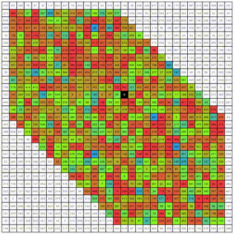

# Balto's Puzzle
This repository includes the **Visualizer** and **Solver** (16th place) for the **Al Zimmermann's Programming Contest: [Balto's Puzzle](http://azspcs.com/Contest/BaltosPuzzle)**.

## Visualizer
The Visualizer is implemented using **Rust + WASM** and provides an interactive way to view solutions for Balto's Puzzle.  
You can access it directly on [GitHub Pages](https://shimo-1999.github.io/BaltosPuzzle/).

### Example Video
Here is an example video for **n=15**:

## Solver
The Solver is a Rust program that implements a **difference-based Beam Search** algorithm, which is similar to Euler Tour Beam Search.  
It ranked **16th** in the Balto's Puzzle Contest.

### Details
- **Language**: Rust
- **Path**: `/solver`
- The implementation requires tuning the **beam width** to achieve optimal results.

## Links
- [Balto's Puzzle Contest](http://azspcs.com/Contest/BaltosPuzzle): Official contest description and rules.
- [Visualizer on GitHub Pages](https://shimo-1999.github.io/BaltosPuzzle/): Try the interactive Visualizer.
